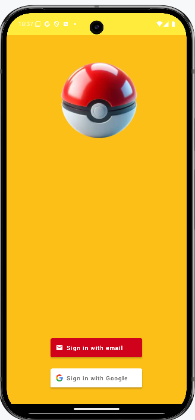
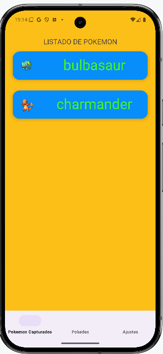
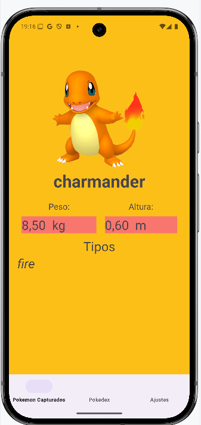
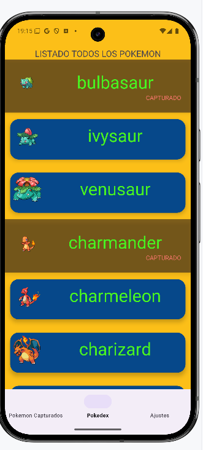
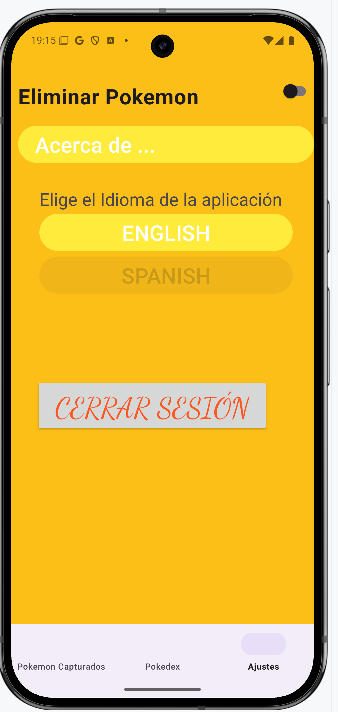

# PokedexMPM

**PokedexMPM** es una aplicación para el seguimiento y control de los pokemon capturados.
***
## Pre-requisitos

Es necesario contar con conexión a *internet* para la descarga de la aplicación a través de la tienda de aplicaciones (Play Store), así como para rellenar la lista de Pokémon a capturar y llevar el control de los Pokémon capturados. 
***
## Descarga e Instalación

La descarga de la aplicación se debe realizar a través de la tienda de aplicaciones para tener la certeza de que no existe ningún problema con la App.

***
## Inicio de la Aplicación
Como requisito para la utilización de **PokedexMPM** se solicita la identificación, ya sea por correo y contraseña o por Inicio de Sesión de Google, este dato es importante porque se utiliza para el control de Pokémon capturados de un usuario.

## Pantallas
+ [Pokemon Capturados](#capturados)
    + [Detalles](#detalles)
+ [Pokedex](#pokedex)
+ [Ajustes](#ajustes)
  

## Pantalla inicial, **Pokémon Capturados**
Tras iniciar sesión con nuestro usuario se nos presentara la pantalla de **Pokémon capturados**, en ésta podemos ver todos los Pokémon que hemos capturado, y que hemos indicado en la Pantalla [**Pokedex**](#pokedex). Si realizamos un click en cualquier Pokémon se nos abrirá la pantalla de [**Detalles**](#detalles). Si deslizamos cualquier pokemon hacia cualquier lado, se eliminará, siempre que lo hayamos indicado en [**Ajustes**](#ajustes).

 
### Detalles
Pantalla donde se nos muestra información detallada del Pokémon seleccionado mediante un clic en la pantalla Pokémon Capturados, en ella podemos ver una imagen del Pokémon, el nombre, el peso, la altura y los tipos a los que pertenece. Para volver a la pantalla de pokemon capturados pulsaremos retroceso.

 
 
## Pokedex
Esta pantalla nos muestra un listado de Pokémon donde podremos clicar sobre ellos para indicar que los hemos capturado, marcándose como tal.
Este listado contiene 150 Pokémon que es el número que hemos  indicado en la programación.

``Call<PokemonRetrofit> pokemonRetrofitCall = pokemonApi.obtenerListaPokemon(150,0);``

## Ajustes
En esta pantalla se nos presenta una serie de ajustes e información sobre la aplicación.
En primer lugar vemos un switch donde podemos elegir entre poder borrar o no los pokemon capturados.
Debajo tenemos un boton que al pulsarlo nos da información sobre el desarrolador y la version de la app.
A continuación podemos elegir entre dos idiomas (español e ingles) simplemente pulsando el idioma de nuestra eleccion.
Y por último tenemos la tecla para cerrar sesión.

# TECNOLOGIAS UTILIZADAS

+ [Firebase Authentication](https://firebase.google.com/docs/auth?hl=es-419)

